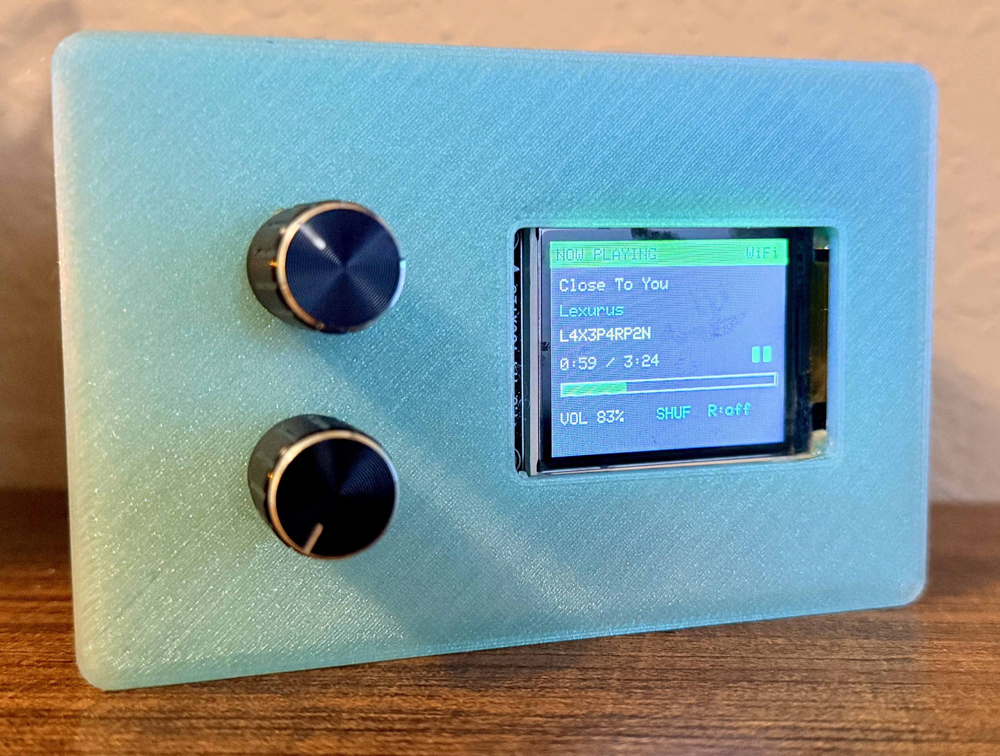
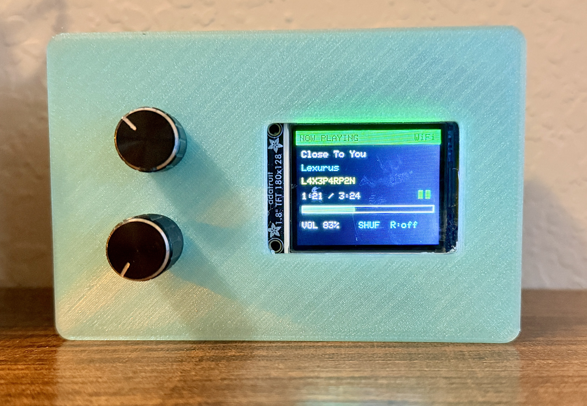
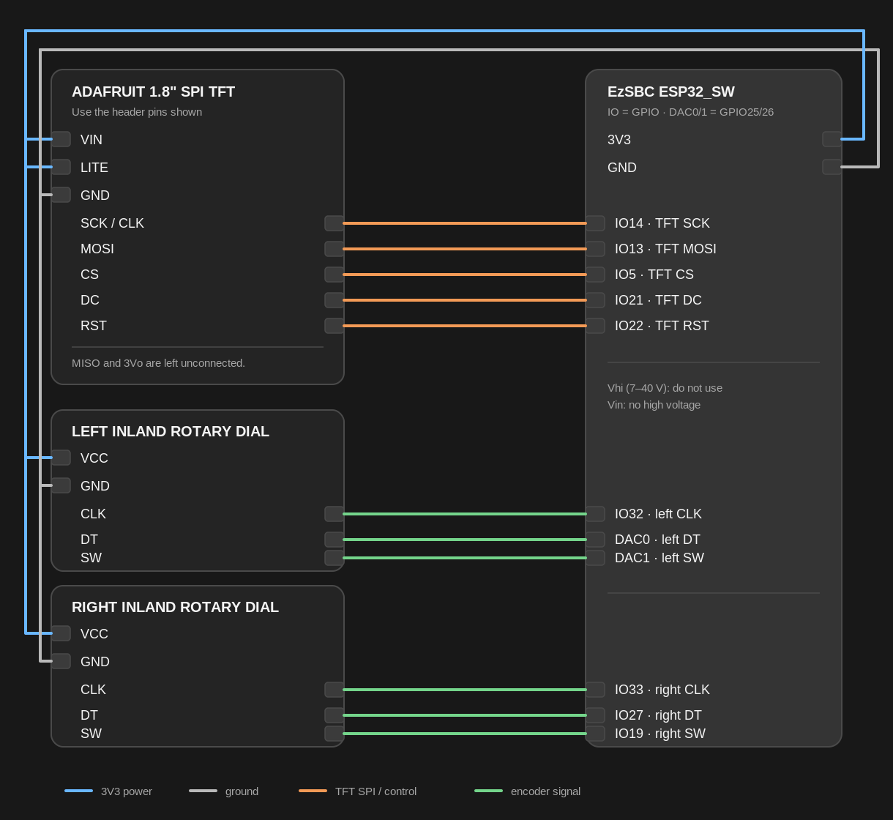

# Spotify Thing

An ESP32 desk remote for Spotify Connect. It shows the current Spotify session on a 160 x 128 ST7735 display and uses two rotary encoders for control.

The ESP32 does not play audio. It controls another Spotify Connect device, such as a phone, computer, or speaker.

## What you need

- An ESP32-WROOM-32E board
- A 160 x 128 ST7735 display
- Two rotary encoders with push switches
- A Spotify Premium account
- PlatformIO

You also need a Spotify app with the redirect URI `http://127.0.0.1:8765/callback`.

## Quick start

1. Wire the board, display, and encoders. Use the [wiring diagram](readme_assets/wiring-diagram.png) and the tables below. **Use 3.3 V only!**
2. Create a Spotify app and add `http://127.0.0.1:8765/callback` as its redirect URI.
3. Run `pairing/pair_spotify.py` to print a refresh-token definition in your own terminal.
4. Copy `firmware/include/secrets.example.h` to `firmware/include/secrets.h` and add your Wi-Fi details, Spotify client ID, and refresh token.
5. Open `firmware` as a PlatformIO project and upload it.

| Path | Purpose |
| --- | --- |
| `firmware/` | ESP32 firmware |
| `pairing/pair_spotify.py` | Local Spotify PKCE pairing utility. Dosen't write the token to disk |
| `enclosure/` | Printable enclosure assets |

## Controls and display

| Control | Turn | Press |
| --- | --- | --- |
| Left dial | Changes the active device volume | Plays or pauses |
| Right dial | Counter-clockwise selects the previous track. Clockwise selects the next track | Opens the device picker. Press again to transfer playback to the selected device |

The display shows the title, artist, active Connect device, elapsed time, volume, shuffle state, and repeat state. Opening the picker refreshes the available Connect devices.

### Remote photos





## Limits and token safety

- **Spotify playback controls require Premium.**
- New Spotify Development Mode apps are limited to the app owner and up to five users. The app owner also needs an active Premium subscription. This remote is for *personal use*.
- The remote displays text metadata only. It does not show album art.
- Treat `firmware/include/secrets.h` like a password file. **Do not commit it or share it!**
- The firmware stores refresh-token rotations in ESP32 flash and keeps short-lived access tokens in RAM. If Spotify rejects the refresh token, run the pairing utility again and update only the refresh-token line in `secrets.h`.

## Wiring



These pin assignments are for the ESP32-WROOM-32E. The board labels `IO18` and `GPIO 18` refer to the same pin. `DAC0` and `DAC1` are GPIO 25 and GPIO 26, and this project uses them as digital inputs.

Use 3.3 V for the display and both encoders. **ESP32 GPIO is not 5 V tolerant**. Power the board by USB. Leave `J1-13` (`Vhi`) and `J1-4` / `J2-19` (`Vin`) unconnected. `Vhi` is the board's 7-40 V input, and **a high-voltage supply on `Vin` can damage the board.**

`J1` and `J2` are the 20-pin headers in the supplied schematic. Their pin numbers run from 1 at the top to 20 at the bottom. Use `J1-9` for a 3.3 V rail and `J1-20` for ground. Connect the display and both encoders to those rails. `J1-18` and `J2-9` are also 3.3 V pins, and `J2-20` is also ground.

The display uses the ESP32 HSPI pins. This keeps its clock off the board's blue LED pin. Do not use the older IO18 / IO23 display wiring with this firmware.

| Adafruit TFT label | EzSBC ESP32_SW pin | Notes |
| --- | ---: | --- |
| `VIN` / `VCC` | `3V3` rail from `J1-9` | Use 3.3 V only |
| `GND` | `GND` rail from `J1-20` | All components need a common ground |
| `SCL` / `SCK` | `J2-11` · `IO14` / `GPIO 14` | HSPI clock. It does not use the on-board LED pin |
| `SDA` / `MOSI` | `J2-12` · `IO13` / `GPIO 13` | HSPI data |
| `CS` | `J2-14` · `IO5` / `GPIO 5` | Chip select |
| `DC` / `A0` | `J1-16` · `IO21` / `GPIO 21` | Data or command select |
| `RES` / `RST` | `J1-15` · `IO22` / `GPIO 22` | Reset |
| `LITE` | `3V3` rail from `J1-9` | Backlight always on |
| `MISO` and `3Vo` | | Leave disconnected |

| Dial | Module label | ESP32 pin |
| --- | --- | ---: |
| Left | `CLK` | `J1-8` · `IO32` / `GPIO 32` |
| Left | `DT` | `J1-10` · `DAC0` / `GPIO 25` |
| Left | `SW` | `J1-11` · `DAC1` / `GPIO 26` |
| Right | `CLK` | `J1-7` · `IO33` / `GPIO 33` |
| Right | `DT` | `J1-12` · `IO27` / `GPIO 27` |
| Right | `SW` | `J2-5` · `IO19` / `GPIO 19` |
| Both | `VCC` | `3V3` rail from `J1-9` |
| Both | `GND` | `GND` rail from `J1-20` |

Many ST7735 modules label their SPI input `SDA`. It is not I²C SDA in this project. If the display has incorrect colors or shifted output, change `INITR_BLACKTAB` to `INITR_GREENTAB` in `firmware/src/App.cpp`, then upload again.

## Create the Spotify app

1. Open the [Spotify Developer Dashboard](https://developer.spotify.com/dashboard), create an app, and copy its client ID. Do not create or use a client secret.
2. In the app settings, add this redirect URI exactly:

   ```text
   http://127.0.0.1:8765/callback
   ```

   Spotify requires the literal `127.0.0.1` address. Do not replace it with `localhost` unless this has changed and I haven't updated this readme.

## Pair Spotify with PKCE

Run the pairing utility from the repository root:

```bash
python3 pairing/pair_spotify.py --client-id YOUR_SPOTIFY_CLIENT_ID
```

Sign in and approve the request in the browser. The utility prints one `#define SPOTIFY_REFRESH_TOKEN ...` line in your terminal. Copy that line into `firmware/include/secrets.h` yourself. **Do not commit or share it!**

The utility uses Authorization Code with PKCE. The project does not use a Spotify client secret, and the utility does not write tokens to disk.

## Configure and upload

1. Install [PlatformIO](https://platformio.org/). The VS Code extension is the simplest option imo but to each their own.
2. Copy `firmware/include/secrets.example.h` to `firmware/include/secrets.h`.
3. Add your Wi-Fi name, Wi-Fi password, public `SPOTIFY_CLIENT_ID`, and refresh-token line.
4. Open `firmware` in PlatformIO and upload:

   ```bash
   pio run --target upload
   ```

5. Reset the ESP32. It joins Wi-Fi, syncs its clock, and then connects to Spotify over HTTPS. Start music on a Spotify Connect device and use the right dial to select a device if needed.

## Troubleshooting

- **No active Spotify device**: Start playback in a Spotify client, then move a dial to refresh the remote. **Some inactive or restricted Connect devices cannot accept commands.** Diag those directly.

- **Token refresh rejected**: Run `pairing/pair_spotify.py` again, replace only the refresh-token line in `secrets.h`, and upload the firmware.

- **Waiting for NTP clock**: Wait a few seconds after Wi-Fi connects. HTTPS certificate validation needs a correct clock.

- **White or black screen**: Check `CS`, `DC`, `RST`, `SCK`, and `MOSI`. Confirm every ground connection, then try the alternate ST7735 tab setting above.

- **Dial direction is reversed**: Swap that dial's `CLK` and `DT` connections.

- **A control action is rejected**: Spotify may mark the selected Connect device as restricted. Choose another device in the picker or control that device directly.

## 3D-printable enclosure

[`enclosure/`](enclosure/) contains two STL files, the front and the back. Adjust as needed for your own parts or preferences.

## Sources

This design follows Spotify's documentation for [playback state](https://developer.spotify.com/documentation/web-api/reference/get-information-about-the-users-current-playback), [device discovery](https://developer.spotify.com/documentation/web-api/reference/get-a-users-available-devices), [playback transfer](https://developer.spotify.com/documentation/web-api/reference/transfer-a-users-playback), [Authorization Code with PKCE](https://developer.spotify.com/documentation/web-api/tutorials/code-pkce-flow), [refreshing tokens](https://developer.spotify.com/documentation/web-api/tutorials/refreshing-tokens), [redirect URIs](https://developer.spotify.com/documentation/web-api/concepts/redirect_uri), and the [February 2026 Development Mode changes](https://developer.spotify.com/documentation/web-api/tutorials/february-2026-migration-guide). The wiring and power warning come from EzSBC's [ESP32_SW product page](https://ezsbc.shop/products/esp32_sw-high-supply-voltage-breakout-and-development-board) and [schematic repository](https://github.com/EzSBC/ESP32_SW).